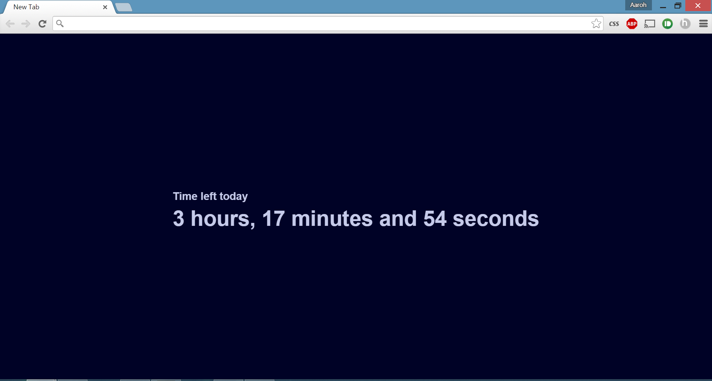

Daily Motivation
========

This was originally forked from [maccman's Motivation](https://github.com/maccman/motivation) which displayed your age as time went on. However, it stopped giving me a motivation boost after a couple weeks, so I made this extension. It counts down the hours, minutes, and seconds left today to keep you motivated throughout your day.

It feels like you're always competing on the clock to get your tasks done!

